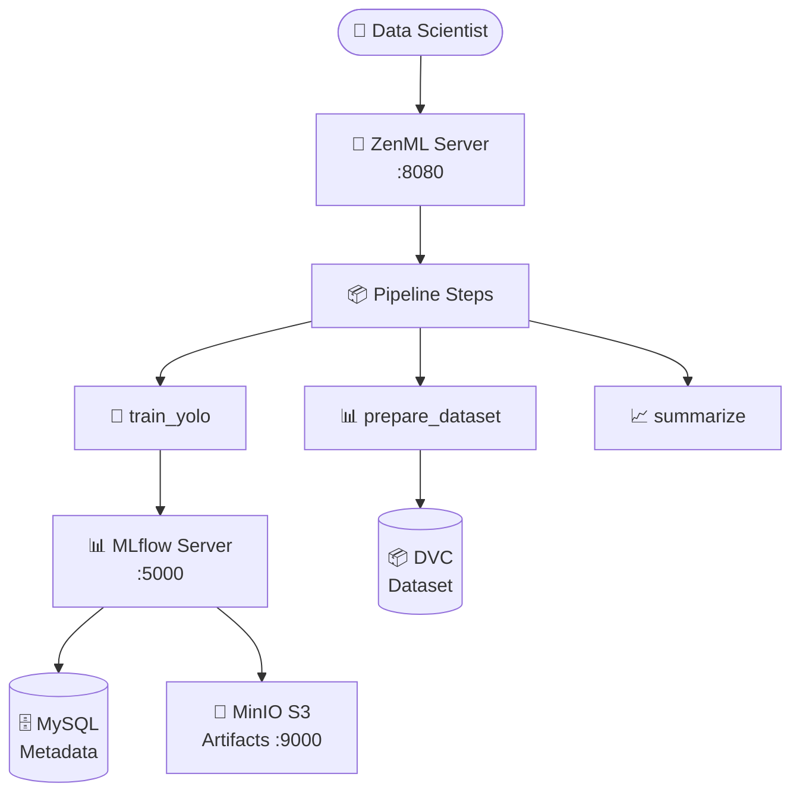
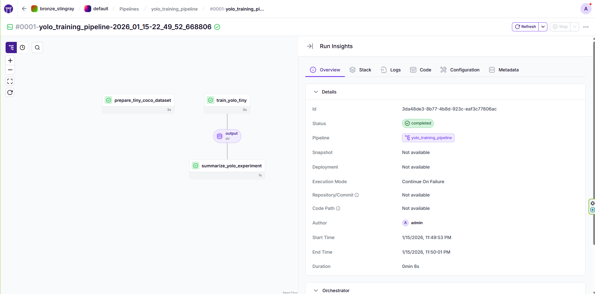

# 🔄 Pipelines MLOps avec ZenML et MLflow

[](https://www.python.org/)
[](https://zenml.io/)
[](https://mlflow.org/)
[](https://min.io/)
[](https://www.docker.com/)

## 📋 Vue d'Ensemble

Ce projet démontre la mise en place d'un **pipeline MLOps complet** pour la détection d'objets (YOLO tiny) en utilisant **ZenML** comme orchestrateur, **MLflow** pour le tracking des expériences, **MinIO** pour le stockage d'artefacts S3-compatible, et **DVC** pour le versioning des données.

### 🎯 Objectifs du Projet

- Orchestrer un pipeline ML de bout en bout avec ZenML
- Intégrer MLflow pour le suivi des métriques et artefacts
- Utiliser MinIO comme stockage cloud-ready S3-compatible
- Gérer le versionnage des données avec DVC
- Automatiser l'entraînement et l'évaluation de modèles YOLO

### ✨ Fonctionnalités Clés

- **🔄 ZenML Pipelines** : Orchestration modulaire avec `@step` et `@pipeline`
- **📊 MLflow Tracking** : Suivi complet des paramètres, métriques et artefacts
- **💾 MinIO S3** : Stockage d'artefacts cloud-ready compatible AWS S3
- **📦 DVC** : Versionnage robuste des datasets pour reproductibilité
- **🐳 Docker Compose** : Infrastructure complète containerisée

---

## 🏗️ Architecture Technique



### Stack Technologique

| Composant | Version | Rôle | Port |
|-----------|---------|------|------|
| **ZenML** | 0.50+ | Orchestration de pipelines | 8080 |
| **MLflow** | 2.9+ | Experiment tracking & model registry | 5000 |
| **MinIO** | Latest | Stockage artefacts S3-compatible | 9000, 9001 |
| **MySQL** | 8.0 | Backend database | 3306 |
| **YOLOv8** | ultralytics | Modèle de détection d'objets | - |
| **DVC** | 3.0+ | Versionnage de données | - |

---

## 🚀 Installation et Configuration

### Prérequis

- **Docker** (20.10+) et **Docker Compose** (v2.0+)
- **Python** 3.11+
- **Git** et **DVC**
- Au moins **8 GB de RAM**

### Étape 1 : Cloner le Dépôt

```bash
git clone https://github.com/chaima-massaoudi/Pipelines-MLOps-avec-ZenML-et-MLflow.git
cd zenml-cv-yolo
```

### Étape 2 : Préparation de l'Environnement

```powershell
# Création de l'environnement virtuel
python -m venv .venv
.\.venv\Scripts\Activate.ps1

# Mise à jour de pip et installation des dépendances
python -m pip install --upgrade pip
pip install -r requirements.txt
```

### Étape 3 : Gestion des Données (DVC)

```powershell
# Générer le dataset minimal (si nécessaire)
python tools/make_tiny_person_from_coco128.py

# Vérifier le tracking DVC (doit être "Up to date")
dvc status
```

### Étape 4 : Démarrage de l'Infrastructure Docker

```powershell
# Lancement des services (ZenML, MLflow, MinIO, MySQL)
docker compose up -d

# Vérification du statut
docker compose ps
```

**Accès aux interfaces :**
- 🔄 **ZenML Dashboard** : http://localhost:8080
- 📊 **MLflow UI** : http://localhost:5000
- 💾 **MinIO Console** : http://localhost:9001 (user: `minio`, password: `minio12345`)

### Étape 5 : Configuration de la Stack ZenML

```powershell
# Entrer dans le conteneur serveur
docker exec -it zenml-server bash

# -- À l'intérieur du conteneur --
# 1. Register MLflow Experiment Tracker
zenml experiment-tracker register mlflow_tracker --flavor=mlflow --tracking_uri=http://mlflow:5000 --tracking_token="dummy-token"

# 2. Créer le secret pour MinIO
zenml secret create minio_zenml_secret --aws_access_key_id='minio' --aws_secret_access_key='minio12345'

# 3. Register Artifact Store (S3/MinIO)
zenml artifact-store register minio_artifacts --flavor=s3 --path='s3://zenml-artifacts' --authentication_secret=minio_zenml_secret --client_kwargs='{"endpoint_url": "http://minio:9000"}'

# 4. Register et activer la Stack
zenml stack register mlflow_stack -o default -a minio_artifacts -e mlflow_tracker
zenml stack set mlflow_stack
exit
```

### Étape 6 : Exécution du Pipeline

```powershell
# Connexion au serveur depuis votre machine
zenml connect http://localhost:8080
zenml init

# Sélectionner la stack
zenml stack set mlflow_stack

# Lancer le pipeline Baseline
python -m src.zenml_pipelines.run_yolo_pipeline_baseline

# Lancer la Grille de runs (au moins 4 runs)
python -m src.zenml_pipelines.run_yolo_pipeline_grid
```

---

## 📊 Résultats et Analyse

### Résultats de la Grille (Experiment: `cv_yolo_tiny`)

| ID | Epochs | Imgsz | mAP@50 | Precision | Recall | Statut |
|:---|:---:|:---:|:---:|:---:|:---:|:---|
| 1 | 3 | 320 | 0.42 | 0.45 | 0.38 | ✅ Success |
| 2 | 5 | 320 | 0.48 | 0.51 | 0.44 | ✅ Success |
| 3 | 3 | 416 | 0.45 | 0.48 | 0.41 | ✅ Success |
| **4** | **5** | **416** | **0.52** | **0.55** | **0.49** | 🚀 **STAGING** |

**Décision** : Promotion du **Run 4** en Staging car il maximise le mAP@50 tout en restant stable.

---

## 📝 Concepts Clés ZenML

### Décorateurs `@step` et `@pipeline`

- **`@step`** : Transforme une fonction Python en étape de pipeline ZenML. Permet le suivi des entrées/sorties (artifacts), le **caching** automatique et l'exécution isolée.
- **`@pipeline`** : Définit la structure globale (DAG) du processus MLOps. Orchestre l'ordre d'exécution des étapes et assure le flux de données.

### Artefacts Produits par Chaque Step

| Step | Type d'Artefact | Description |
|------|-----------------|-------------|
| `prepare_tiny_coco_dataset` | **Données** | Chemin vers le dataset validé par DVC |
| `train_yolo_tiny` | **Modèle** | Fichier `.pt` d'Ultralytics + logs |
| `summarize_yolo_experiment` | **Rapport** | Métadonnées récapitulant les performances |

### Stockage : ZenML vs MLflow

| Composant | Ce qui est stocké |
|-----------|-------------------|
| **ZenML Server** | Métadonnées : noms des runs, configs stacks, historique exécutions |
| **MinIO** | Fichiers réels : dataset préparé, poids du modèle |
| **MLflow** | Métriques scientifiques, courbes, matrices de confusion |

---

## 📸 Captures d'écran



---

## 💡 Réflexion MLOps

L'usage de ZenML apporte une **reproductibilité** totale. Pour GitLab CI, il suffirait d'ajouter un runner avec accès réseau au serveur ZenML et d'utiliser une API Key pour automatiser ces exécutions.

---

## 📚 Ressources

- [Documentation ZenML](https://docs.zenml.io/)
- [Documentation MLflow](https://mlflow.org/docs/latest/)
- [Documentation MinIO](https://min.io/docs/)
- [Guide YOLOv8 Ultralytics](https://docs.ultralytics.com/)
